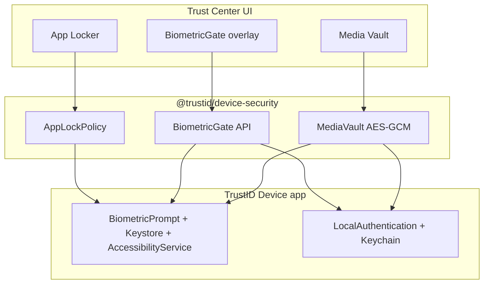

# Tier 1 � Consumer Device Security Layer

Local, on-device privacy controls for the TrustID standalone client. This layer is **not** part of the IdP / Zero-PII OAuth path: vault keys and lock policy never leave the device, and the API never sees vault plaintext.

## Goals

1. **Hardware-enforced biometric gate** � Face ID / Touch ID / Android BiometricPrompt (Class 3 preferred). Optional weak PIN only when the user explicitly enables `allowDeviceCredential`.
2. **Secure media vault** � AES-256-GCM ciphertext in app-private storage; DEK unlocked only after biometric CryptoObject / Keystore auth.
3. **App locker / process shield** � Intercept launches of user-selected packages and present a biometric overlay before the target UI is usable.

## Runtime topology



| Surface | Package / path |
|---------|----------------|
| Shared TS contracts + Web Crypto fallback | `packages/device-security` |
| Capacitor shell + plugin bridges | `apps/device` |
| Android Keystore / Accessibility | `apps/device/native/android` |
| iOS LAContext / Keychain | `apps/device/native/ios` |
| Management UI | `apps/web` ? `/dashboard/vault`, `/dashboard/app-locker` |

## Cryptographic model

| Material | Storage | Unlock |
|----------|---------|--------|
| Vault DEK (256-bit) | Android Keystore / iOS Secure Enclave (when wrapped) | Biometric `CryptoObject` / `SecAccessControl` biometryCurrentSet |
| Media ciphertext | App-private files (`*.tvm`) | After DEK unlock |
| Content hash (SHA-256) | Vault catalog (metadata only) | N/A |
| App lock list | Encrypted SharedPreferences / Keychain | After gate |

**Web / PWA fallback:** IndexedDB ciphertext + non-extractable Web Crypto key gated by TrustID WebAuthn UV (`reauthenticate`). This is **not** Keystore-grade; native Device app is required for enclave binding and gallery wipe / app lock.

## Secure import & wipe

1. User picks photo/video via system picker (SAF / PhotoKit / web file input).
2. Bytes read once into memory ? AES-GCM encrypt ? write vault object.
3. Original removal:
   - **Android 11+:** `MediaStore.createDeleteRequest` (user confirms system dialog) � silent delete of other apps� media is blocked by the OS.
   - **iOS:** limited; user must grant Photo Library write; complete �invisible to Photos� requires storing only in app container (originals removed only if writable).
   - **Web:** cannot erase the system gallery; originals remain unless the user deletes them manually.

Vault objects live only under the app sandbox and are omitted from MediaStore indexes / Files UI.

## App locker

### Android

`AppLockAccessibilityService` watches `TYPE_WINDOW_STATE_CHANGED`. When the foreground package is in the lock set and not in a short post-auth grace window, TrustID launches `AppLockOverlayActivity` (BiometricPrompt, `setAllowedAuthenticators(BIOMETRIC_STRONG)` by default). The target task stays obscured until success.

Requires: Accessibility permission + (Android 10+) overlay / appear-on-top as needed for the lock UI.

### iOS

Apple does **not** allow third-party apps to intercept arbitrary app launches. Tier 1 on iOS exposes:

- In-app biometric gate for TrustID itself
- Guided Screen Time / Focus setup copy
- No Accessibility-style process shield

Document this limit in product UX; do not claim cross-app lock on iOS.

### Desktop

Process monitoring is OS-specific (future). Tier 1 ships mobile-first; desktop shows capability unavailable.

## Policy defaults

```ts
{
  allowDeviceCredential: false, // no PIN/pattern fallback unless user opts in
  biometricStrongOnly: true,
  postAuthGraceMs: 8_000,
  lockOnBackground: true
}
```

## Threat notes

- Accessibility-based lock is **best-effort** against sophisticated attackers who disable Accessibility or use ADB; it raises the bar for casual / shoulder / shared-device access.
- Compromised OS / root / jailbreak voids Keystore / enclave assumptions.
- Vault recovery without biometrics is intentionally out of scope for Tier 1 (no cloud DEK backup).

## Build

```bash
npm install
npm run build -w @trustid/device-security
npm run build -w @trustid/web
# Native shell (after Android SDK / Xcode):
npm run sync -w @trustid/device
```
